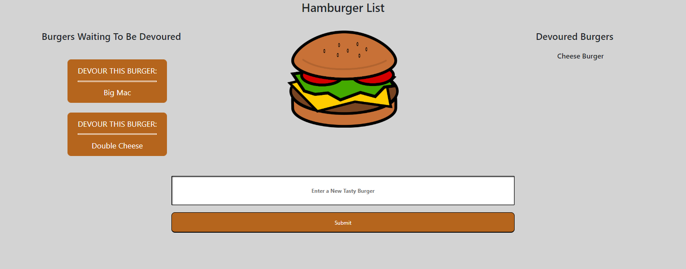

# //--Burger Application V1.0--//

Application to track different types of burgers the user wants to eat.

This will track the entered burgers in a database so it can be recalled anywhere.

[Repo](https://github.com/Jkbotham/burger)

